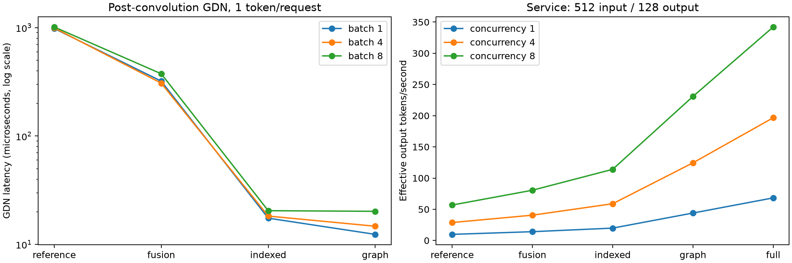

# H100 performance report

All numbers below come from `results/`. Full numeric data is in [measurements.json](measurements.json).
The service matrix contains 60 measured workload runs and 600 requests. The final
matrix uses the H100 worker, the pinned environment in `requirements/`, and the
Qwen3.8-27B checkpoint configured by `LIGHTDELTA_MODEL_PATH`.

## GDN operator

| Batch | Tokens/request | Reference µs | Fused packed µs | Indexed µs | Graph µs |
| --- | --- | --- | --- | --- | --- |
| 1 | 1 | 983.09 | 321.23 | 17.47 | 12.38 |
| 1 | 2 | 1476.64 | 313.04 | 18.91 | 14.11 |
| 1 | 3 | 1781.74 | 326.14 | 21.22 | 16.14 |
| 1 | 4 | 2089.46 | 313.46 | 19.90 | 19.17 |
| 4 | 1 | 995.09 | 307.68 | 18.27 | 14.72 |
| 4 | 2 | 1525.97 | 314.86 | 19.73 | 19.50 |
| 4 | 3 | 1831.23 | 313.06 | 24.70 | 24.48 |
| 4 | 4 | 2111.70 | 300.53 | 30.46 | 30.10 |
| 8 | 1 | 1014.74 | 375.63 | 20.48 | 20.21 |
| 8 | 2 | 1797.76 | 305.09 | 31.98 | 31.84 |
| 8 | 3 | 1872.11 | 312.96 | 42.24 | 42.29 |
| 8 | 4 | 2117.74 | 367.98 | 53.73 | 53.57 |

## Incremental service throughput

Ratios use the same workload and the mean throughput across rounds. The denominator is the preceding configuration, except E/A.

| Input/output | Concurrency | Fusion B/A | Indexed C/B | Graph D/C | MTP E/D | Full E/A |
| --- | --- | --- | --- | --- | --- | --- |
| 512/128 | 1 | 1.44× | 1.40× | 2.22× | 1.55× | 6.96× |
| 512/128 | 4 | 1.41× | 1.45× | 2.11× | 1.58× | 6.83× |
| 512/128 | 8 | 1.42× | 1.42× | 2.02× | 1.48× | 6.02× |
| 4096/128 | 1 | 1.48× | 1.40× | 2.07× | 1.53× | 6.58× |
| 4096/128 | 4 | 1.46× | 1.37× | 1.79× | 1.33× | 4.76× |
| 4096/128 | 8 | 1.35× | 1.30× | 1.60× | 1.20× | 3.39× |

## Removal and depth ablations

Throughput relative to E/full (1.00×). Values below one are slower. The final column is full TTFT divided by fused-prefill TTFT; above one means lower TTFT with fused prefill state I/O.

| Input/output | Concurrency | No graph | Packed states | Fused prefill | MTP depth 1 | MTP depth 2 | Prefill TTFT ratio |
| --- | --- | --- | --- | --- | --- | --- | --- |
| 512/128 | 1 | 0.57× | 0.92× | 0.98× | 0.91× | 1.04× | 0.97× |
| 512/128 | 4 | 0.62× | 0.88× | 0.98× | 0.86× | 1.00× | 1.00× |
| 512/128 | 8 | 0.66× | 0.82× | 0.98× | 0.89× | 1.01× | 1.00× |
| 4096/128 | 1 | 0.61× | 0.94× | 0.99× | 0.90× | 0.99× | 1.00× |
| 4096/128 | 4 | 0.72× | 0.92× | 0.99× | 0.94× | 1.00× | 1.00× |
| 4096/128 | 8 | 0.80× | 0.90× | 0.99× | 0.95× | 0.99× | 1.00× |

## Streaming service

TTFT and TPOT are medians across measured requests. Throughput is the mean of available per-round aggregate rates; a range is shown only for multiple rounds.

| Configuration | Input/output | Concurrency | Runs | TTFT ms | TPOT ms | Output tok/s (run range) | Mean acceptance length | Draft acceptance |
| --- | --- | --- | --- | --- | --- | --- | --- | --- |
| full | 4096/128 | 1 | 1 | 460.94 | 13.04 | 60.73 | 2.57 | 52.2% |
| full | 4096/128 | 4 | 1 | 1007.54 | 22.00 | 121.72 | 2.56 | 52.1% |
| full | 4096/128 | 8 | 1 | 1616.05 | 28.77 | 168.36 | 2.54 | 51.5% |
| full | 512/128 | 1 | 1 | 136.50 | 13.25 | 68.25 | 2.37 | 45.7% |
| full | 512/128 | 4 | 1 | 265.82 | 15.11 | 196.63 | 2.48 | 49.5% |
| full | 512/128 | 8 | 1 | 258.11 | 17.37 | 342.10 | 2.50 | 49.9% |
| full_no_graph | 4096/128 | 1 | 1 | 482.98 | 23.26 | 37.30 | 2.57 | 52.2% |
| full_no_graph | 4096/128 | 4 | 1 | 1036.26 | 30.93 | 88.11 | 2.54 | 51.2% |
| full_no_graph | 4096/128 | 8 | 1 | 1623.17 | 36.90 | 133.92 | 2.54 | 51.4% |
| full_no_graph | 512/128 | 1 | 1 | 160.35 | 23.42 | 38.98 | 2.41 | 46.9% |
| full_no_graph | 512/128 | 4 | 1 | 236.89 | 25.01 | 122.76 | 2.47 | 48.9% |
| full_no_graph | 512/128 | 8 | 1 | 308.18 | 26.52 | 226.20 | 2.50 | 50.0% |
| full_packed | 4096/128 | 1 | 1 | 463.25 | 14.14 | 57.11 | 2.55 | 51.6% |
| full_packed | 4096/128 | 4 | 1 | 1042.88 | 24.86 | 111.38 | 2.56 | 52.1% |
| full_packed | 4096/128 | 8 | 1 | 1650.93 | 33.39 | 151.65 | 2.54 | 51.5% |
| full_packed | 512/128 | 1 | 1 | 134.80 | 14.51 | 63.10 | 2.41 | 47.1% |
| full_packed | 512/128 | 4 | 1 | 297.03 | 17.81 | 172.28 | 2.48 | 49.5% |
| full_packed | 512/128 | 8 | 1 | 289.42 | 22.27 | 279.63 | 2.50 | 49.9% |
| full_prefill | 4096/128 | 1 | 1 | 461.33 | 13.27 | 60.04 | 2.57 | 52.2% |
| full_prefill | 4096/128 | 4 | 1 | 1010.99 | 22.25 | 120.51 | 2.56 | 52.1% |
| full_prefill | 4096/128 | 8 | 1 | 1619.76 | 29.06 | 166.71 | 2.54 | 51.5% |
| full_prefill | 512/128 | 1 | 1 | 141.41 | 13.52 | 66.92 | 2.37 | 45.7% |
| full_prefill | 512/128 | 4 | 1 | 265.36 | 15.83 | 192.94 | 2.47 | 49.1% |
| full_prefill | 512/128 | 8 | 1 | 257.27 | 17.68 | 336.52 | 2.50 | 49.9% |
| fusion | 4096/128 | 1 | 1 | 452.66 | 70.33 | 13.64 | — | — |
| fusion | 4096/128 | 4 | 1 | 1306.67 | 74.50 | 37.41 | — | — |
| fusion | 4096/128 | 8 | 1 | 1585.41 | 82.69 | 67.24 | — | — |
| fusion | 512/128 | 1 | 1 | 162.62 | 70.08 | 14.11 | — | — |
| fusion | 512/128 | 4 | 1 | 306.66 | 72.15 | 40.55 | — | — |
| fusion | 512/128 | 8 | 1 | 498.96 | 72.09 | 80.52 | — | — |
| graph | 4096/128 | 1 | 1 | 404.49 | 22.24 | 39.65 | — | — |
| graph | 4096/128 | 4 | 1 | 1288.25 | 26.69 | 91.52 | — | — |
| graph | 4096/128 | 8 | 1 | 1561.09 | 37.29 | 139.75 | — | — |
| graph | 512/128 | 1 | 1 | 97.02 | 22.14 | 43.99 | — | — |
| graph | 512/128 | 4 | 1 | 254.53 | 22.98 | 124.40 | — | — |
| graph | 512/128 | 8 | 1 | 442.97 | 23.84 | 230.79 | — | — |
| indexed | 4096/128 | 1 | 1 | 429.55 | 49.15 | 19.14 | — | — |
| indexed | 4096/128 | 4 | 1 | 1263.68 | 52.87 | 51.07 | — | — |
| indexed | 4096/128 | 8 | 1 | 1555.62 | 63.46 | 87.37 | — | — |
| indexed | 512/128 | 1 | 1 | 140.85 | 49.62 | 19.82 | — | — |
| indexed | 512/128 | 4 | 1 | 280.78 | 49.70 | 58.90 | — | — |
| indexed | 512/128 | 8 | 1 | 465.05 | 50.09 | 114.02 | — | — |
| mtp1 | 4096/128 | 1 | 1 | 437.72 | 14.73 | 54.79 | 1.86 | 85.5% |
| mtp1 | 4096/128 | 4 | 1 | 1388.95 | 20.24 | 114.11 | 1.82 | 82.4% |
| mtp1 | 4096/128 | 8 | 1 | 1383.95 | 30.42 | 160.64 | 1.81 | 80.7% |
| mtp1 | 512/128 | 1 | 1 | 123.40 | 15.50 | 61.85 | 1.86 | 86.1% |
| mtp1 | 512/128 | 4 | 1 | 242.88 | 17.28 | 169.62 | 1.80 | 80.2% |
| mtp1 | 512/128 | 8 | 1 | 234.95 | 18.88 | 303.42 | 1.79 | 79.4% |
| mtp2 | 4096/128 | 1 | 1 | 449.23 | 13.07 | 60.10 | 2.35 | 67.4% |
| mtp2 | 4096/128 | 4 | 1 | 987.36 | 20.37 | 122.27 | 2.30 | 64.8% |
| mtp2 | 4096/128 | 8 | 1 | 1364.07 | 30.20 | 166.04 | 2.25 | 62.3% |
| mtp2 | 512/128 | 1 | 1 | 128.98 | 12.86 | 71.06 | 2.29 | 64.7% |
| mtp2 | 512/128 | 4 | 1 | 258.29 | 14.98 | 197.01 | 2.31 | 65.5% |
| mtp2 | 512/128 | 8 | 1 | 291.42 | 16.40 | 346.31 | 2.32 | 66.1% |
| reference | 4096/128 | 1 | 1 | 490.29 | 106.03 | 9.23 | — | — |
| reference | 4096/128 | 4 | 1 | 1370.38 | 112.79 | 25.57 | — | — |
| reference | 4096/128 | 8 | 1 | 1636.59 | 113.70 | 49.65 | — | — |
| reference | 512/128 | 1 | 1 | 193.81 | 100.97 | 9.81 | — | — |
| reference | 512/128 | 4 | 1 | 349.96 | 103.92 | 28.78 | — | — |
| reference | 512/128 | 8 | 1 | 532.81 | 103.12 | 56.78 | — | — |

## Memory and generation checks

| Configuration | Peak device memory MiB |
| --- | --- |
| full | 74251 |
| full_no_graph | 74141 |
| full_packed | 74781 |
| full_prefill | 74389 |
| fusion | 74119 |
| graph | 74269 |
| indexed | 74199 |
| mtp1 | 74471 |
| mtp2 | 74363 |
| reference | 74245 |

Native-vLLM regression: 30/30 exact token-sequence matches across 10 server launches. Every suite launch asserts these matches.

Longer workload token comparisons against A are retained in `workload_token_checks` in the numeric report. A matching prefix is a numerical regression observation; it does not measure answer quality.

Logged first-use JIT warnings inside timed regions: 0. The audit uses each workload's before/after `/metrics` requests in the server log; it detects logged warnings, not every possible compilation event.

## Interpretation and limits

The delivered matrix uses one complete round after the warmup correction. No statistical confidence interval or 512-token output speedup is claimed.

A/reference and B/fusion share the exact Torch gather/scatter path. B/A isolates fused computation; C/indexed removes packing; D/graph captures decode; E/full enables three MTP candidates. Removal configurations and depths one/two are measured separately. These incremental gains depend on the preceding optimizations; isolated operator speedups do not predict end-to-end speedups.

The operator graph captures the GDN boundary alone; the service graph captures the full decode model. Their speedup ratios therefore measure different scopes.

Operator CUDA-event timing excludes initial-state restoration. Service requests use identical engineering-review, code and Chinese test-planning prompts, fixed lengths, temperature zero, disabled prefix caching and closed-loop concurrency. Throughput counts emitted tokens. TPOT averages the interval from first to last emitted token; MTP may deliver multiple tokens in one SSE event. Warmup uses the actual concurrent workload and is excluded from timing.

Generation checks compare fixed English, Chinese and code prompts to native vLLM token sequences. They are regression checks, not a general model-quality benchmark. Peak device memory includes weights, reserved KV cache, graph allocations and process overhead, sampled every 200 ms.
The runtime reserves cache against the same 90% device-memory budget, so total device memory is not a direct measure of transient state-copy savings.

Operator event timing follows an untimed state restore and may benefit from a warm
cache; it is not an HBM bandwidth or achieved-occupancy measurement.

Precision and state semantics are implemented in `python/lightdelta/reference/`
and `python/lightdelta/backend.py`.
